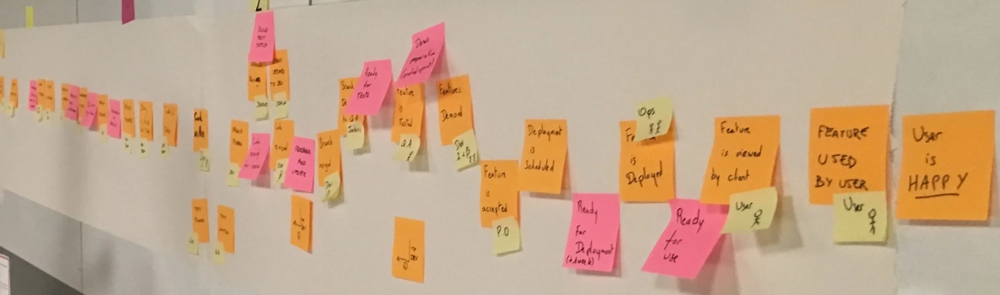
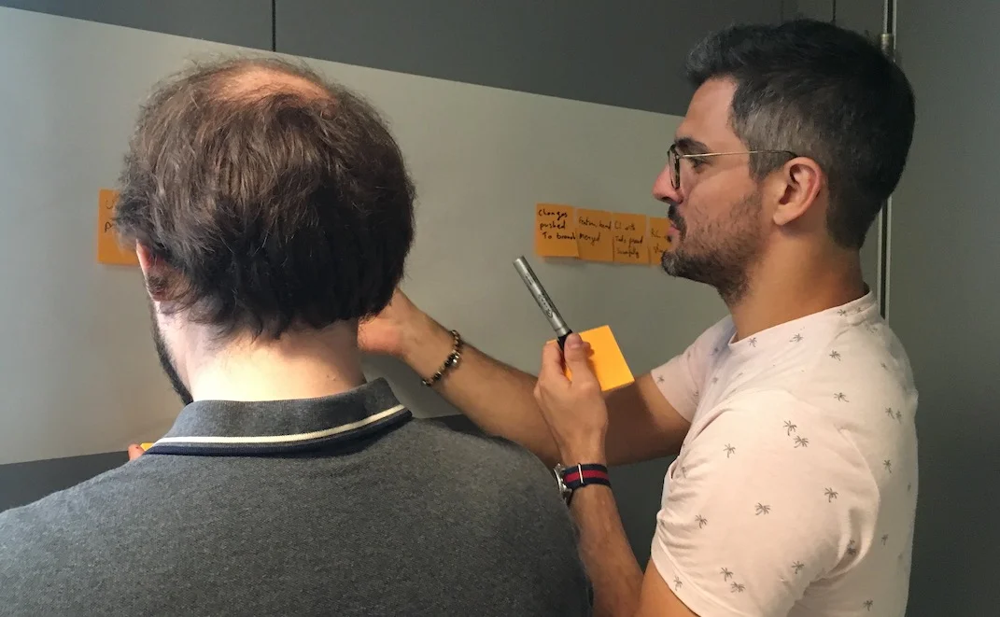
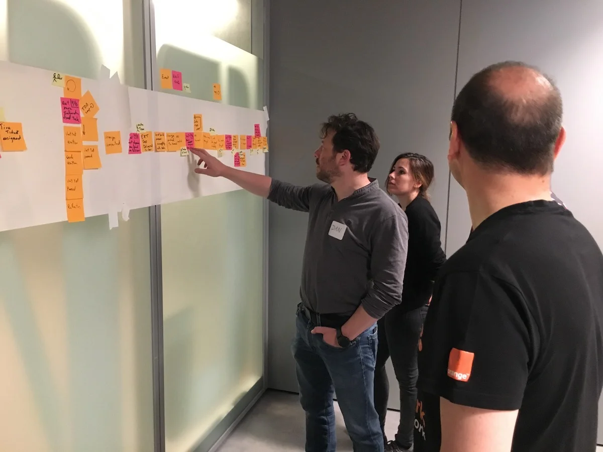
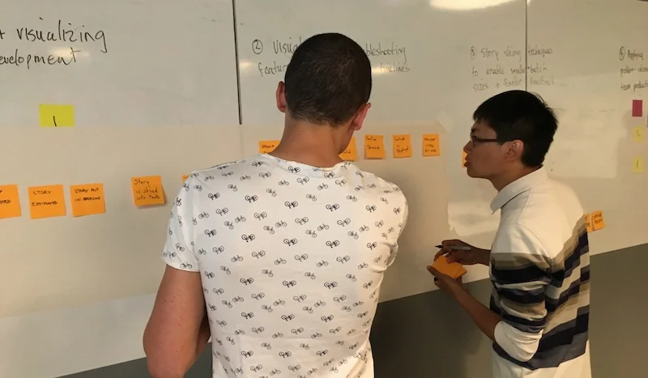
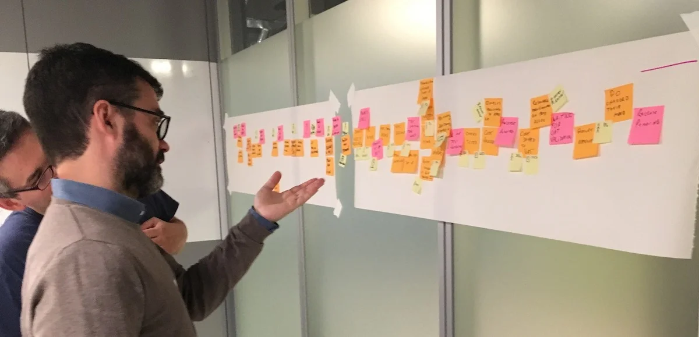
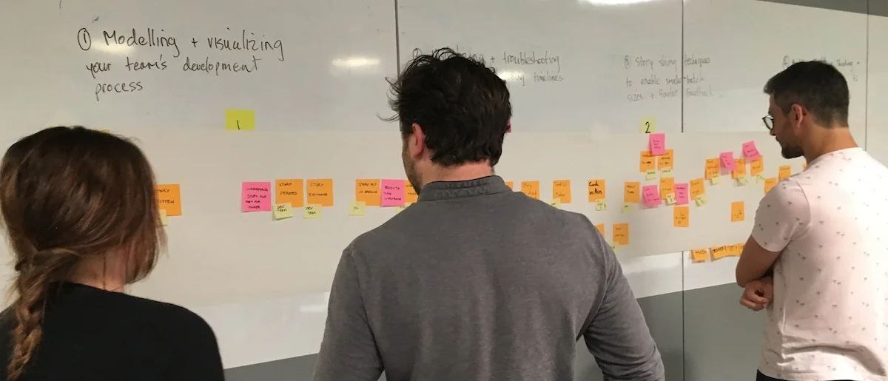
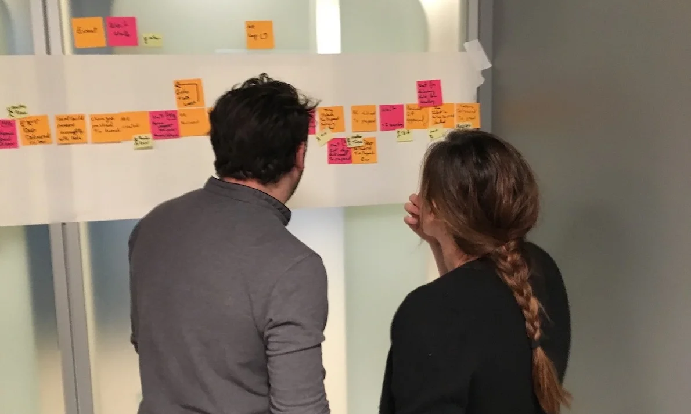

Most development teams remain blissfully unaware of the negative impact of these invisible queues on productivity, or how to deal with them effectively. After all, how can we fight an invisible enemy? Isn't it better to focus on the problems we *can* see? So the typical team approach to improving productivity is to focus on the work being done. For example, trying to make the coding more efficient, or by starting new work when something gets blocked.

## What's the Big Deal with Queues?

> "The enemy of flow is the invisible and unmeasured queues that undermine all aspects of product development performance".
>
> — Donald Reinertsen
> *The Principles of Product Development Flow*

What if all these wait-states are actually where we should be focusing our improvement efforts first? According to Reinertsen, these invisible piles of unfinished work slow us down far more than we realize, sucking team productivity, and making everything take longer than it should.

In my NewCrafts 2018 talk, [Fighting the Invisible Enemy](http://videos.ncrafts.io/video/275328050), I go more deeply into these ideas, and provide some ideas for how to think about them.

> "The lack of understanding about how work flows - or, more commonly, doesn't flow - across a work system that's sole purpose is to deliver value to a customer is a fundamental problem that results in poor performance, poor business decisions, and poor work environments."
>
> — Karen Martin & Mike Osterling
> *Value Stream Mapping*

I've been experimenting with EventStorming as a way of helping teams quickly visualize their development process and identify emergent queues. The goal for the talk was to provide practical ways for teams to understand the presence and negative impact of these invisible queues on their work, so they could start to manage them more effectively.

### Visual Unification Tools

Task boards are a great tool for helping teams visualize and coordinate their work, but they don't show the full picture. Typically they only focus on flow of work for an individual team, ignoring upstream and downstream impacts and dependencies, and often without taking a customer-focused perspective. Also, they often tend to ignore wait states for work items rather than making them explicit on the board.

For those familiar with value stream mapping, EventStorming can function as a lightweight, collaborative, first-pass approach to visualizing a value stream and a team's place within it.

EventStorming can function as a lightweight step in the direction of value stream mapping. The conversation that it enables and the map that it produces "can function as a visual unification tool, by enabling a team to visualize work that's not particularly visual."

As with the visualization applied in value stream mapping, visualizing the invisible work is "an essential first step to gaining clarity about and consensus around how work gets done. It's also a highly unifying activity - helps people see the need for improvement, and generates alignment and consensus around specific improvements being considered." - [Value Stream Mapping](https://www.amazon.com/Value-Stream-Mapping-Organizational-Transformation/dp/0071828915).

**The goal is to visualize queues so they can be managed effectively, starting with the ones that have the most significant impact economically.**

### Visualizing Your Team Flow

As with regular [EventStorming](https://leanpub.com/introducing_eventstorming), the team performs an initial brainstorm where everyone writes as many events as possible at the same time. I recommend you map out the events that occur from an initial feature idea, all the way to the point where the delivered functionality is used by a customer to solve a problem or meet a need. Don't worry about possible duplication or event sequence at this point where everyone is writing events.

Events are written in the past tense, as if everyone is looking back on the completed process. For example, write "story estimated" rather than "estimate story," or write "changes pushed to production" rather than "push changes to production."

Once you have a good representative sample of events, arrange them chronologically in sequence, earliest on the left to latest on the right. Don't worry about loops or conditionals...just lay it out as if it's a linear flow. It's more important at this point to capture the overall sequence rather than various possible paths. Eliminate any duplicates, though keep an eye out for differences in terminology for events as they may be significant in terms of uncovering different perspectives or misunderstandings.

> **Tip:** If you have trouble doing this because you have many different types of work items, such as defects, production support, feature development... start with a specific user story, or a bug, and map that one out first. Once you have a flow that seems fairly representative for the item being visualized, start you can always add one later in another swimlane.

### Visualizing Queues

Use another color to represent possible/potential queues in the process. Look for anywhere there is:

- a handoff from one person, role, or team to another
- significant waiting. Examples include, but are not limited to: waiting for another team to complete something, or infrastructure to be ready, or some kind of approval, builds to run, pull requests to be approved, peer reviews to complete, time spent waiting for testing to happen, ...
- batching of work, such as at sprint planning for Scrum teams
- common points for rework?

For every queue, talk it through as a team in terms of how much of a friction point it is for the overall flow. Are there simple ways to reduce the time that work spends in that queue?

**The goal is to NOT to eliminate all queues but to manage and constrain them.**

Capture any problems, questions, hotspots or conversation points on bright colored stickies. For example, if you find an event that is frequently associated with rework, it would be a good one to call out as a problem area for future investigation/experimentation.

### Improving Flow

Identify the queue with the most significant economic/productivity impact. If you don't know which it is, start measuring it. Begin gathering data on problematic areas, and then run small improvement experiments.

Some possible tactics for managing an emergent queue to improve overall flow:

- Set a WIP limit for this queue.
- See if the queue can be eliminated, perhaps through automation (e.g. CI/CD) or better collaboration (BDD, devops)
- Use the EventStorming map to build out a kanban board so you can limit WIP at the team and work state levels.

See also my [Modeling Team Flow](https://www.youtube.com/watch?v=q80FiugsO1Q) talk at Explore DDD 2018 for a slightly updated version of the Newcrafts talk. I also mention a number of other techniques for managing and constraining emergent queues.

I also introduced this technique at last year's EventStorming Summit in Bologna. I learned there that others had already experimented with similar approaches using EventStorming in the past.

If you map an entire value stream flow from "concept to cash" it is common to notice how small the development team part of the process is, and it is possible that the most damaging queues in terms of economic impact are upstream or downstream from the team. Once everything is mapped out, for non-trivial flows a common comment I hear is: "I had no idea we had so many queues."

I'd be interested in hearing about anyone experimenting with this approach, such as for a team retrospective or workshop. I haven't tried to be comprehensive here, as I'm interested in learning what questions/feedback others have.

---

**Update:** I presented on this topic at two conferences in 2018: [Fighting the Invisible Enemy](/speaking) (NewCrafts 2018 keynote) and [Modeling Team Flow](/speaking) (Explore DDD 2018). Both talks are available on my [speaking page](/speaking).
