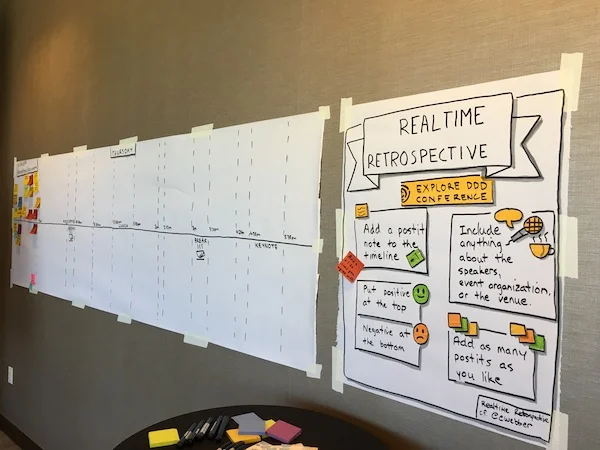
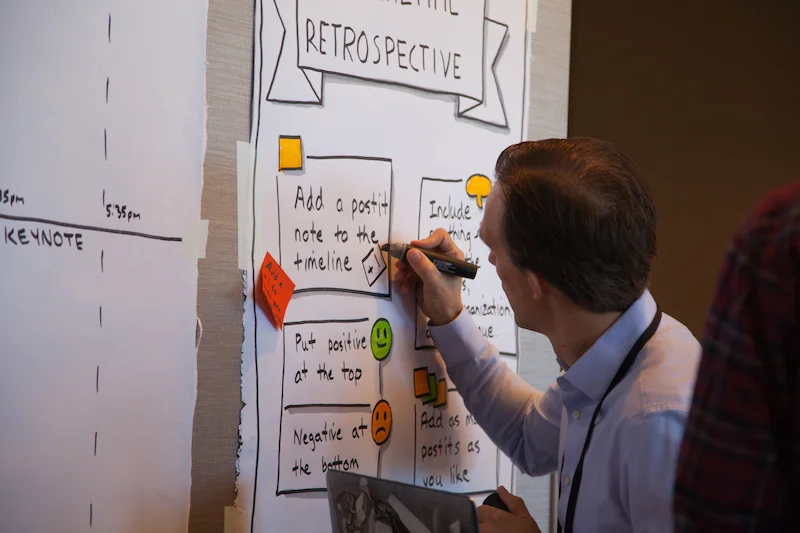
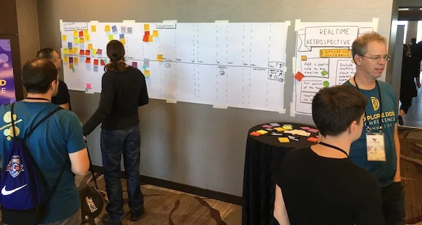
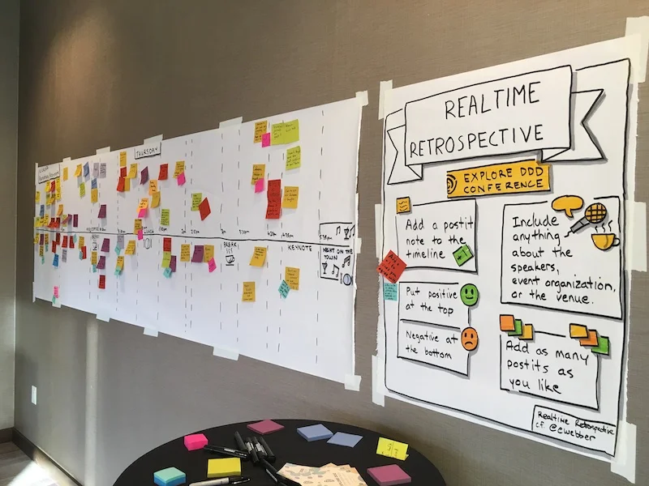
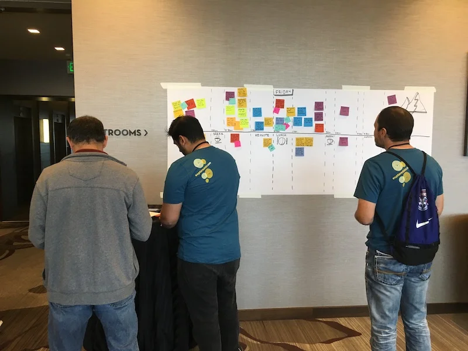
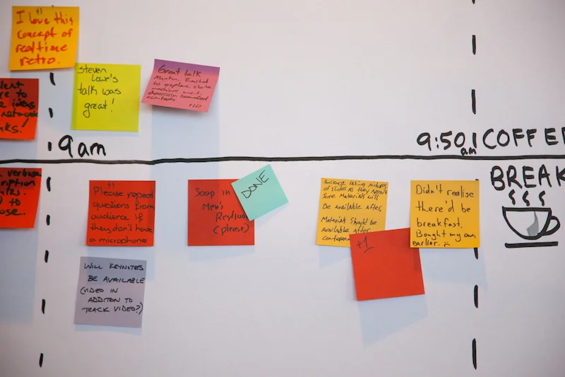
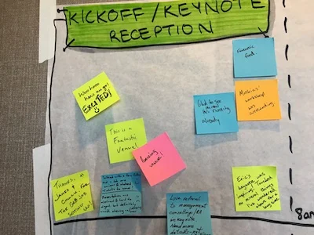
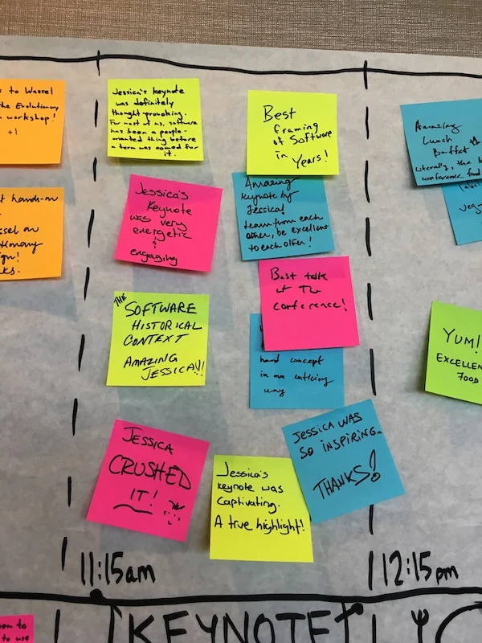

At YOW! 2016, fellow speaker Emily Webber told me about a cool experiment she had run at recent conference. Emily described a visible, participative way - a [Realtime Retrospective](https://emilywebber.co.uk/the-realtime-retrospective) - to reflect and improve throughout a conference. In September 2017 I was able to run my first realtime retrospective experiment at [Explore DDD 2017](http://exploreddd.com/2017).

> "The realtime retrospective is a way of capturing feedback or information to help improvements in realtime."
>
> — Emily Webber
> *[The Realtime Retrospective](https://emilywebber.co.uk/the-realtime-retrospective)*

Prior to the start of the conference we laid out a visual summary of the conference schedule along with instructions for how to contribute/participate. We also provided plenty of sharpies and colorful sticky notes.

We placed the conference schedule on the wall in the main conference space area where everyone would be passing by to maximize exposure. During the conference opening and also prior to each keynote we reminded and encouraged attendees to contribute. It didn't take long for attendees to start posting and interacting with the timeline.

We had conference staff and volunteers keeping an eye on the timeline so negative things got resolved almost immediately and marked as done. We used Slack as a backchannel to coordinate this through the volunteers. We also used the main conference Slack channel and Twitter for some of the questions, such as whether videos of the talks would be available after the conference. Venue staff also liked being notified of issues so they could deal with them quickly. The overall sense of participation, openness and responsiveness generated by the timeline was high value for organizers, volunteers, speakers and attendees alike.

For example, a problem with not enough soap in the mensroom was fixed within five minutes, and we resolved most AV and venue-related issues very quickly. Things that couldn't be fixed or improved were marked on the timeline and noted for next time. Since we were dealing with questions and issues in near-realtime and visually marking them on the wall, it was clear to attendees that things were improving.

As a conference leadership we felt it was very successful, so we employed it again last year for Explore DDD 2018 and once again were very happy with how well it worked.

We've heard good things from speakers both years about the value of the immediate feedback. One of our 2017 speakers was so encouraged by the feedback he kept his sticky note comments as a memento after the conference.

The realtime retrospective wall has become an integral part of the conference - I couldn't imagine us running [Explore DDD](http://exploreddd.com) without it.
